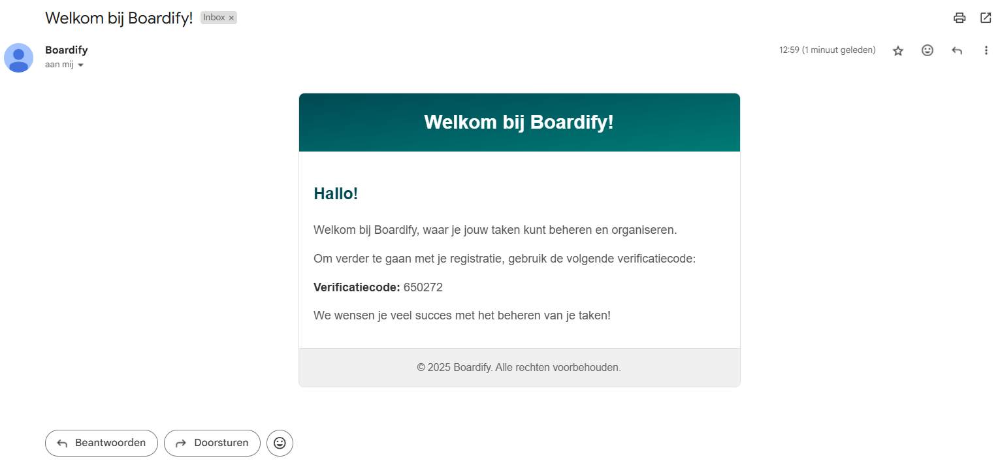
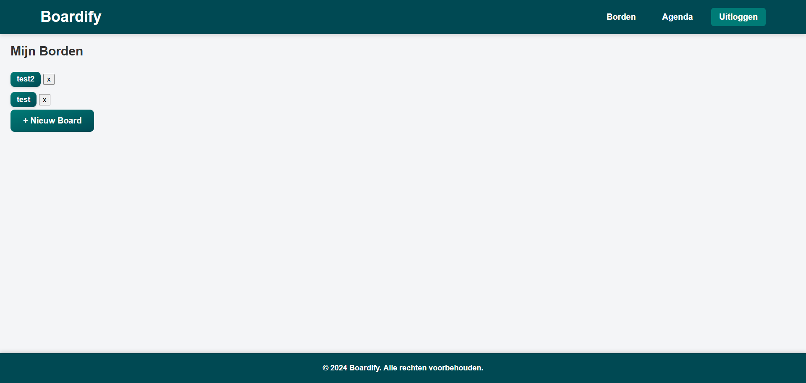

# Boardify

Welkom bij mijn keuzedeelproject voor school.

Boardify is een webapplicatie geïnspireerd op Trello, waarmee je eenvoudig je taken, deadlines en gebeurtenissen kunt organiseren en beheren.

## Functionaliteiten

-  Registreren met een unieke code die wordt verzonden naar je e-mailadres
-  Inloggen met e-mail en wachtwoord
-  Borden aanmaken, bewerken en verwijderen
-  Deadlines en gebeurtenissen toevoegen en beheren binnen elk board

## Screenshots

 ### Homepagina

### Registratiepagina

### verificatie pagina

### Verificatiecode

### Loginpagina

### dashboard

### dashboard

### agenda

